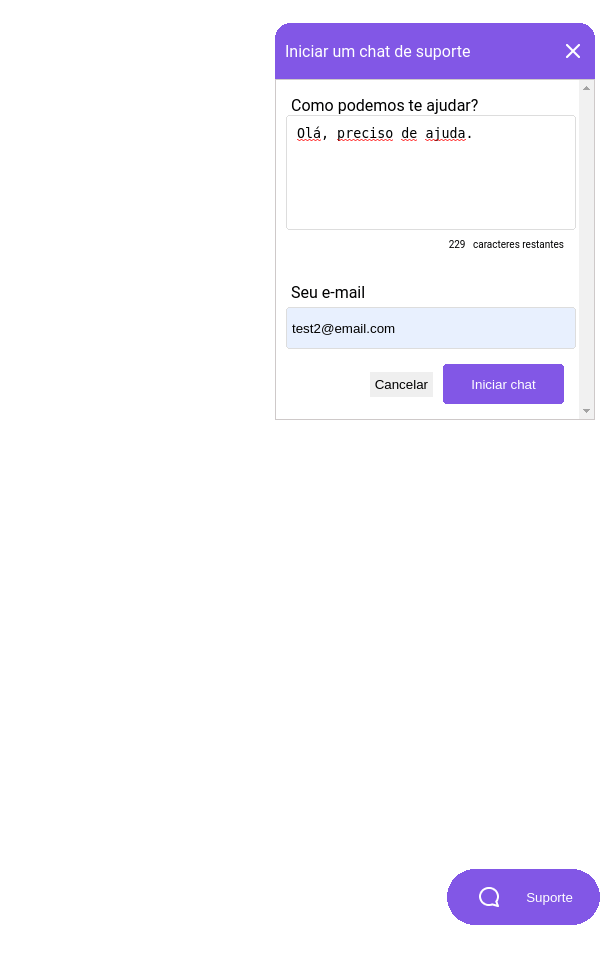
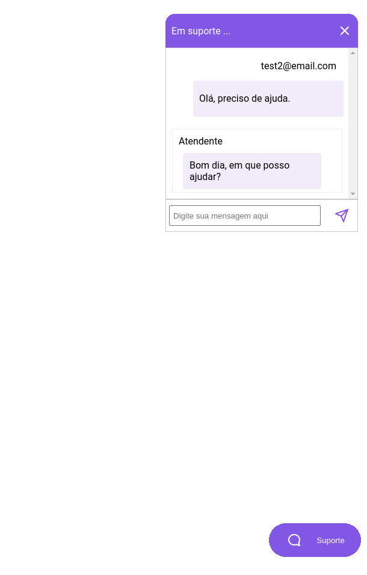
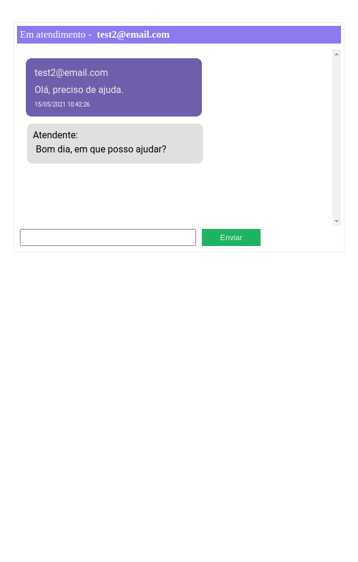

# Rocketseat Next Level Week #5

<h1 align="center">
  Chatty
</h1>

<h1 align="center">
    
    
    
    
</h1>

## 💻 Projeto

Projeto desenvolvido no evento "Next Level Week 5" da [Rocketseat](https://rocketseat.com.br/).

O Chatty é um chat para atendimento de clientes em tempo real.

## :rocket: Tecnologias

Esse projeto foi desenvolvido com as seguintes tecnologias:

- [Node.js](https://nodejs.org/en/)
- [Typescript](https://www.typescriptlang.org/)
- [Express](https://expressjs.com/pt-br/)
- [Socket.io](https://socket.io/)

## 🔨 Como usar

Para clonar essa aplicação, você vai precisar de [Git](https://git-scm.com/), Node.js v14+ e [Yarn](https://yarnpkg.com/) instalado.

### Iniciar Aplicação

```bash
# Diretório da aplicação
cd node/chatty

# Instalar dependências
yarn install

# Rodas as migrações
yarn typeorm migration:run

# Iniciar servidor rodando na porta 3333 (http://localhost:3333)
yarn dev

# Acessar páginas para comunicação com chat
http://localhost:3333/pages/client # CLIENTE
http://localhost:3333/pages/admin # ADMIN

```

---

<sup>Projeto desenvolvido com a tutoria da [Daniele Leão Evangelista](https://github.com/danileao), da [Rocketseat](https://rocketseat.com.br/).</sup>
