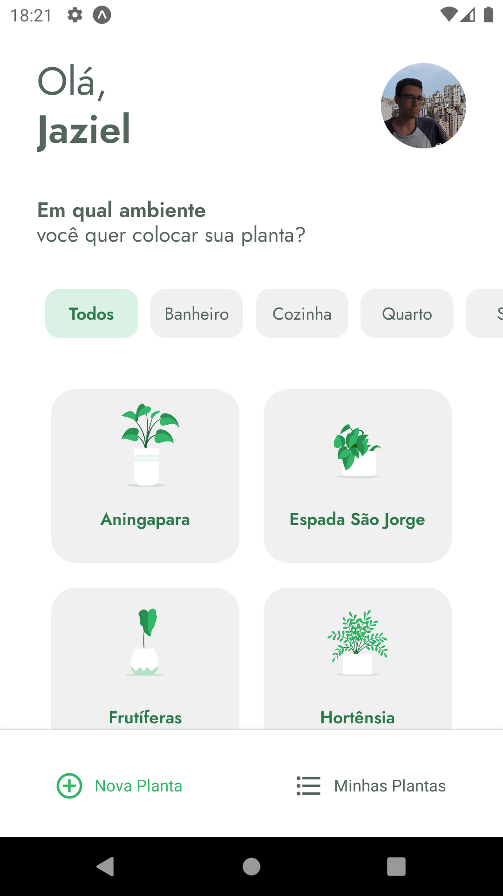
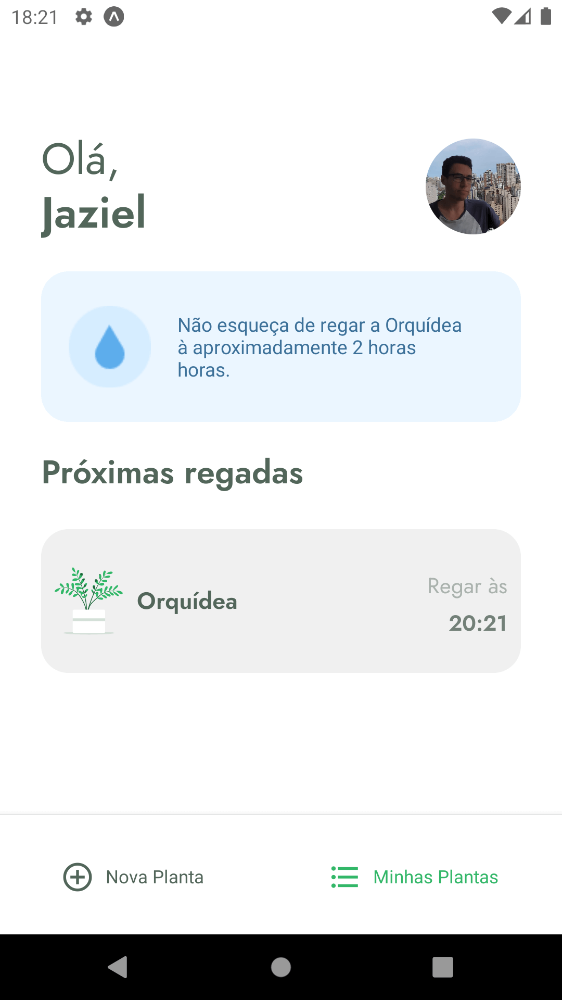
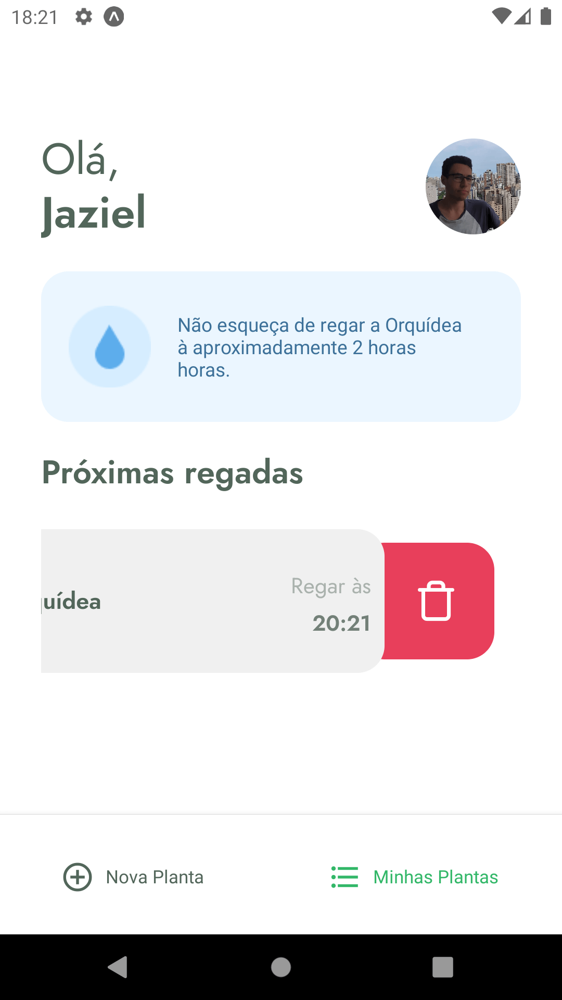

<h1 align="center">
  
</h1>

<h1 align="center">
    
    
    
    
    
    
    
    
</h1>

## 💻 Projeto

Projeto desenvolvido no evento "Next Level Week 5" da [Rocketseat](https://rocketseat.com.br/).

Aplicativo para lhe ajudar a lembrar de cuidar de suas plantas de forma fácil de acordo com cada tipo de plantinha.

## :rocket: Tecnologias

Esse projeto foi desenvolvido com as seguintes tecnologias:

- [React Native](https://reactnative.dev/)
- [Typescript](https://www.typescriptlang.org/)
- [Expo](https://expo.io/)

## 🔨 Como usar

Para clonar essa aplicação, você vai precisar de [Git](https://git-scm.com/), [Node.js](https://nodejs.org/en/) v14+ e [Yarn](https://yarnpkg.com/) instalado.

### Iniciar Aplicação

```bash
# Diretório da aplicação
cd react-native/plantmanager

# Instalar dependências
yarn install

# Iniciar servidor rodando na porta 3000 (http://localhost:3000)
yarn start

# Iniciar servidor backend fake
json-server ./src/services/server.json --host 192.168.0.107 --port 3333 --delay 700
```

## 🔖 Layout

Você pode visualizar o layout do projeto através [desse link](https://www.figma.com/file/IhQRtrOZdu3TrvkPYREzOy/PlantManager/duplicate).

---

<sup>Projeto desenvolvido com a tutoria de [Rodrigo Gonçalves S.](https://github.com/rodrigorgtic), da [Rocketseat](https://rocketseat.com.br/).</sup>
