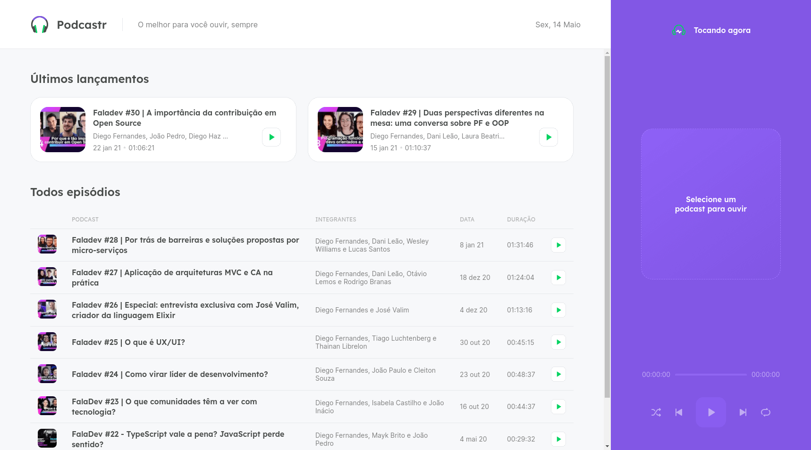
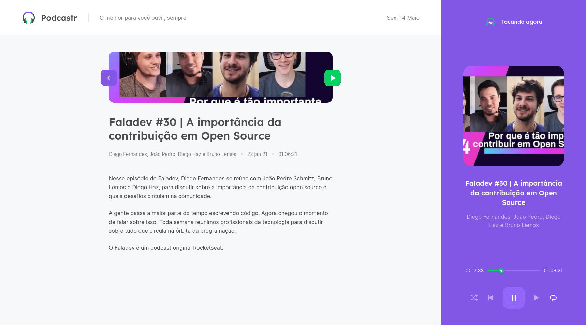

# Rocketseat Next Level Week #5

<h1 align="center">
  
</h1>

<h1 align="center">
    
    
</h1>

## 💻 Projeto

Projeto desenvolvido no evento "Next Level Week 5" da [Rocketseat](https://rocketseat.com.br/).

O podcastr é um app para reprodução de episódios em áudio do seu podcast favorito.

## :rocket: Tecnologias

Esse projeto foi desenvolvido com as seguintes tecnologias:

- [React](https://pt-br.reactjs.org/)
- [Next.js](https://nextjs.org/)
- [TypeScript](https://www.typescriptlang.org/)

## 🔨 Como usar

Para clonar essa aplicação, você vai precisar de [Git](https://git-scm.com/), Node.js v14+ e [Yarn](https://yarnpkg.com/) instalado.

### Iniciar Aplicação

```bash
# Diretório da API
cd react/podcastrnext

# Instalar dependências
yarn install

# Iniciar servidor rodando na porta 3000 (http://localhost:3000)
yarn dev

# Iniciar servidor backend fake
yarn server
```

## 🔖 Layout

Você pode visualizar o layout do projeto através [desse link](https://www.figma.com/file/UwFEntsHpHYJlHNQAQr4gA/Podcastr/duplicate).

## 🧠 Desafio

- Fazer o layout responsivo;

- PWA (next-pwa);

- Tema Dark;

- Criar essa aplicação com Electron.

<sup>Projeto desenvolvido com a tutoria de [Diego Fernandes](https://github.com/diego3g), da [Rocketseat](https://rocketseat.com.br/).</sup>
